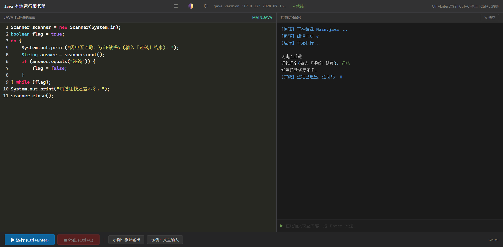

# 🚀 LiveJava

> 使用场景：网页编写Java代码，一键运行即时查看运行结果，支持Scanner交互，适合初学者不需要代码提示的场景
>
> Write Java in your browser, run instantly with one click, supports interactive Scanner input — ideal for beginners who want to focus on logic over IDE setup

<p align="center">
  
</p>

---

## ⚡ 快速开始

```bash
cd main
pip install -r requirements.txt
python server.py
```
浏览器打开 **http://localhost:5000**，或双击 `start.bat`。

---

## ✨ 核心特性

- 📝 **浏览器内编辑** — CodeMirror 语法高亮，无需 IDE
- ⚡ **一键运行** — Ctrl+Enter 即编译运行，实时看输出
- 💬 **Scanner 交互** — 控制台底部直接输入，和程序对话
- 📂 **多文件联动** — 临时多文件模式 + 项目模式，支持跨文件调用
- 🎨 **双主题切换** — 暗色/亮色一键切换
- 🔧 **三 JDK 模式** — 环境/绝对路径/相对路径灵活配置

---

## 📖 完整文档

→ [main/README.md](main/README.md)

---

## 📄 协议

GNU General Public License v3 — 详见 [LICENSE](LICENSE)
