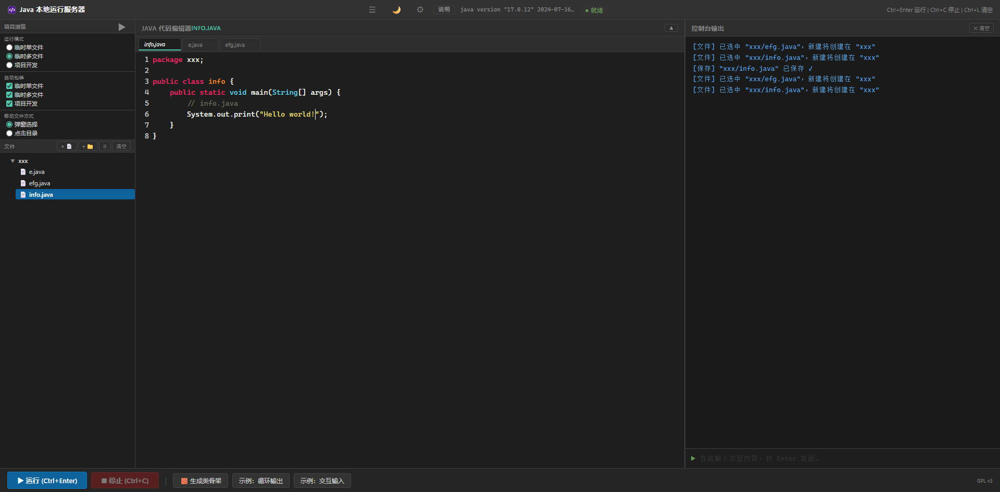

# 🚀 Java 本地运行服务器 v2.4

> 网页编写 Java 代码，一键运行即时查看结果，支持 Scanner 交互，适合初学者不需要代码提示的场景。

---

## 💡 项目初衷

初学 Java 时反复调用 `javac` / `java` 太麻烦，在线编辑器又用不了 Scanner，干脆写个本地 Java 代码网页执行工具。

---

## 📋 环境要求

- **JDK**（推荐 17+）
- **Python 3.10+**

```bash
cd main
pip install -r requirements.txt
```

---

## ⚡ 启动

> 这是一个本地程序，请不要在公网服务器运行！

**方式一：命令行**

```bash
cd main
python server.py
```

浏览器打开 **http://localhost:5000**

**方式二：双击 `start.bat`**



---

## 🎯 快速上手

1. 左侧编辑器写 Java 代码
2. 按 `Ctrl+Enter`（或点击「▶ 运行」）
3. 右侧控制台看输出，底部输入 Scanner 交互

---

## ⌨️ 快捷键

| 快捷键 | 功能 |
|---|---|
| `Ctrl + Enter` | 运行代码 |
| `Ctrl + C` | 停止运行 |
| `Ctrl + S` | 手动保存 |
| `Ctrl + L` | 清空控制台 |
| `Ctrl + B` | 折叠/展开侧栏 |
| `Alt + ←/→` | 切换文件 Tab |
| `Alt + ↑/↓` | 折叠/展开 Tab 栏 |
| `Alt + W` | 关闭当前 Tab |
| `Esc` | 关闭弹窗 |

---

## 📂 运行模式

| 模式 | 说明 |
|---|---|
| 临时单文件 | 单文件快速测试语法 |
| 临时多文件 | 虚拟工作区多文件联调 |
| 项目开发 | 加载真实磁盘目录（src/out 结构） |

- **自动包装**：帮你省掉 `public class xxx { ... }` 框架，直接写逻辑代码即可执行
- **🧱 生成类骨架**：空文件一键插入完整类框架

---

## 🎨 主题与外观

- **8 套预设主题**：Sublime Dark、亮色、Monokai、One Dark、Dracula、Nord、Gruvbox Dark、Solarized Dark
- **自定义主题编辑器**：8 个核心颜色变量可调
- **顶部 ☀️/🌙 按钮**：一键切换亮暗
- **编辑器背景**：支持图片/视频背景，蒙版透明度可调

---

## ⚙️ JDK 配置

| 模式 | 说明 |
|---|---|
| 环境模式 | 从 `JAVA_HOME` / `PATH` 自动检测 |
| 路径模式 | 手动指定 JDK 路径，历史列表管理 |
| 相对模式 | 扫描项目 `jdk/` 目录下 JDK 版本 |

---

## 📄 协议

GNU General Public License v3
