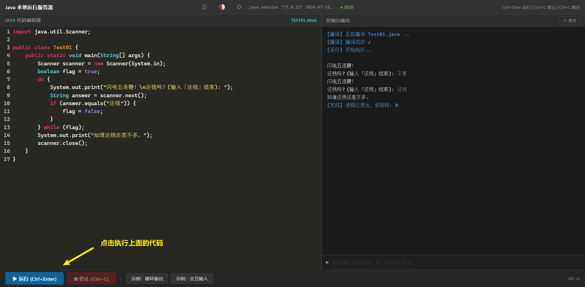
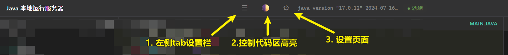
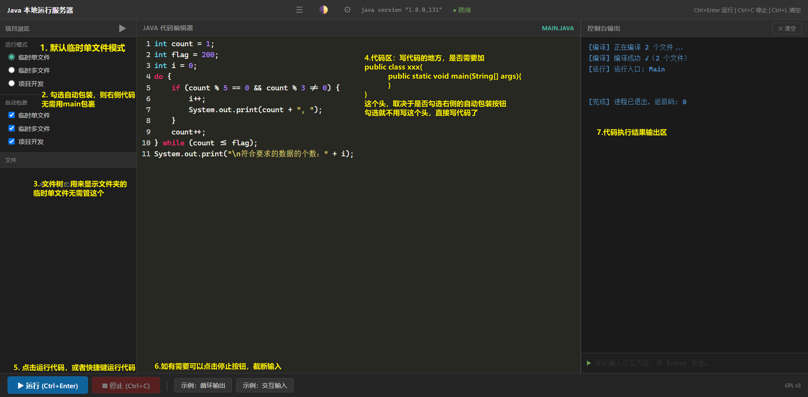
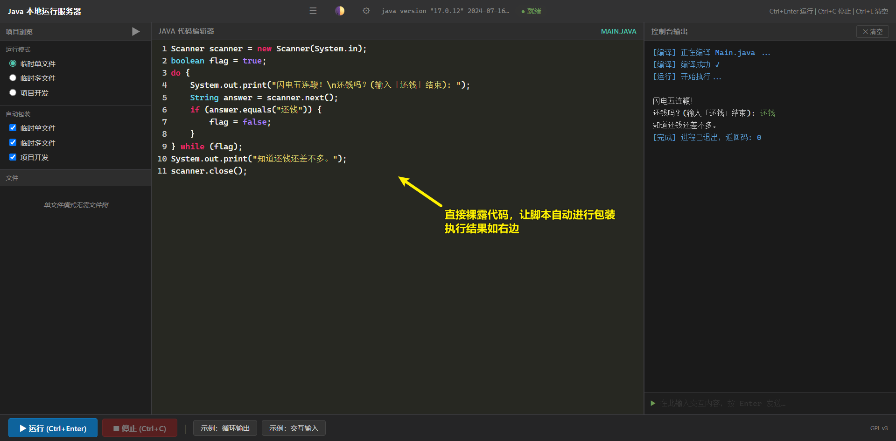
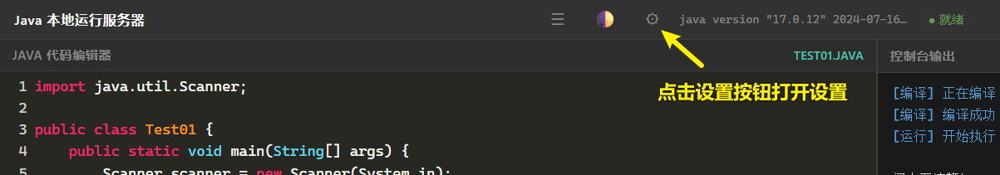

# Java 本地运行服务器 v2.1


## 项目初衷

不废话了，就是初学java的时候遇到`javac` 编译到 `java`运行过程太冗长，还没法实时看到代码和执行效果，又不能看idea代码提示，在线的[菜鸟教程在线编辑器](https://www.runoob.com/try/runcode.php?filename=HelloWorld&type=java)又用不了Scanner，干脆写一个用用。 


## 环境要求

### 1.安装jdk和python

- 已安装 **JDK**（推荐 17+）
- 已安装 **Python 3.10+**

### 2. 配置环境

配置主要是python环境

```bash
cd main
pip install -r requirements.txt
```

## 启动项目

> [!warning]
>
> 这是一个本地程序，请不在公网服务器运行！

1. 在cmd中运行脚本

```bash
cd main
python server.py
```

运行后浏览器打开 **http://localhost:5000**，就能看到UI界面：

2. 如果不想打开cmd，双击bat运行脚本即可，一样是会弹出黑框，然后浏览器打开  **http://localhost:5000** 即可


## 快速上手

1. 左边编辑器写 Java 代码
2. 按 `Ctrl+Enter`（或点击「▶ 运行」）
3. 右边控制台看输出，且右侧底部能输入Scanner可接收的字符串或者整型。




## 界面说明

### 顶部导航栏

如下图，主要分为三个小按钮：



### 主界面

UI详细功能如下图：



优先说明：

-  `自动包装` ： 只能帮你省掉 `public class xxx{public static void main(String[] args){}}` 这个框架，可以直接写代码并执行，具体如下图。`自动包装`模式目的就一个，省点时间，多学点知识。



运行模式：

1. 临时单文件模式：只需要在一个文件内写代码
1. 临时多文件模式：可以在项目的临时文件夹下面写多个代码，这是为了应付后面类与对象的学习准备的。
1. 项目开发：加载一个项目目录，也就是其他项目文件夹可以以这种形式加入进来。

### 设置界面

设置页面的UI说明如下：



- 环境模式：默认从全局环境中读取 `java` 和 `javac` 
- 路径模式：默认从选中的地址中读取 `java` 和 `javac` 
- 相对路径模式：默认从项目的jdk文件夹读取 `java` 和 `javac` ，并且要求用户正确的命名jdk文件夹，且放入的jdk文件夹下面必须就是bin文件夹。

具体详情请看前端的设置界面。

